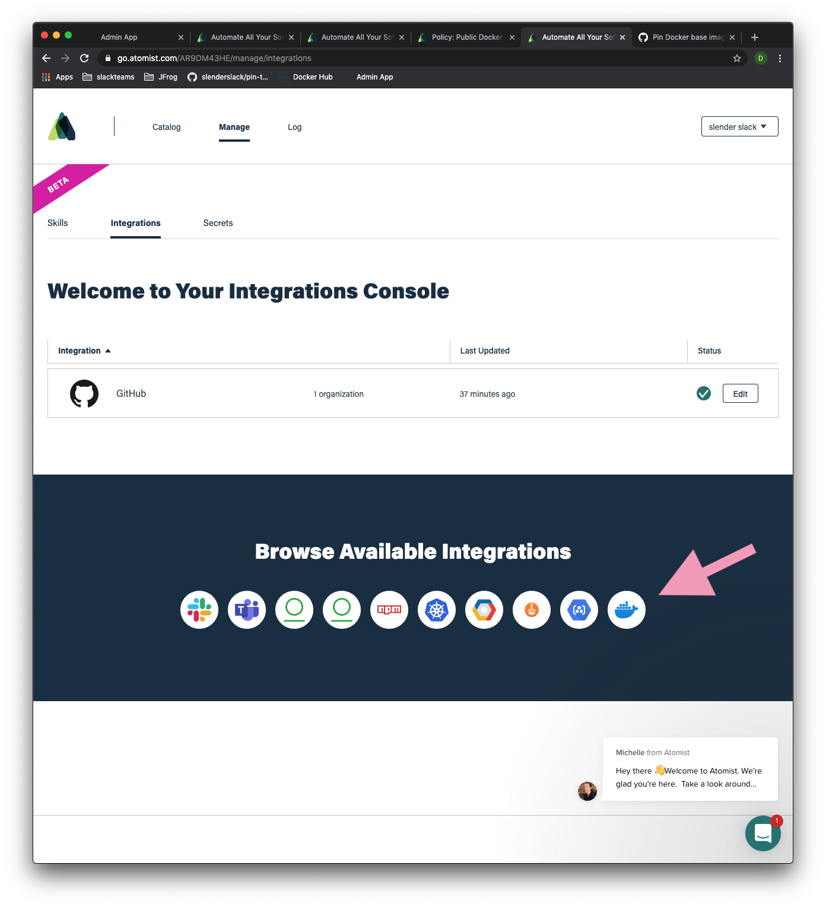
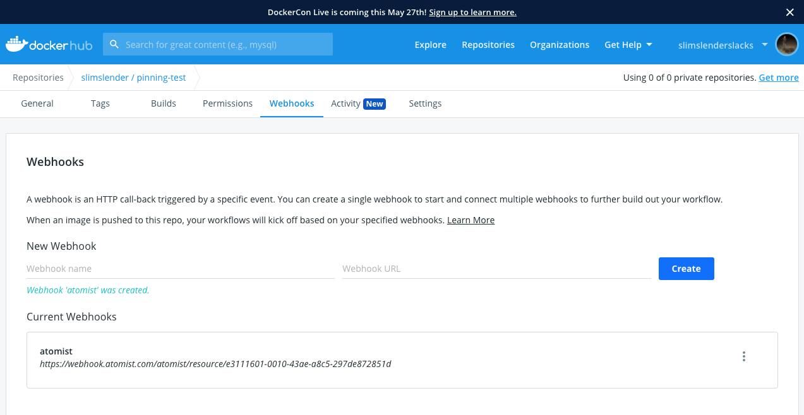

# Docker Hub

[Docker Hub](https://hub.docker.com/) supports webhook notifications for repositories in privately owned namespaces.
Atomist can ingest these notifications to drive policies like [Docker Base Image
Policy](https://go.atomist.com/catalog/skills/atomist/docker-base-image-policy).

## Configuring

Navigate to the [Integrations tab](https://go.atomist.com/r/auth/manage/integrations) and select the Docker Hub
Integration.

To configure the integration:

1.  Create a webhook URL using the "Add Webhook" button.  This URL can be used for any number of DockerHub repositories.
2.  Enter the namespace for your public or private image repositories.
3.  Enter a personal access token, and the corresponding `Docker ID`.

### Adding webhook

After adding a webhook, you'll have to click "save changes" and then return to the Integration Screen a second time to
retrieve the webhook url.

### Docker Id and Namespace

Enter the [`Docker ID`](https://docs.docker.com/docker-id/) and a 
[`Docker Hub Personal Access Token`](https://docs.docker.com/docker-hub/access-tokens/) so that Atomist can query the
repository when new Images and security scans are detected.  Enter the `namespace` containing your public or repositories. This can either be a Docker Hub organization, or your Docker ID.

## Creating Webhook on Docker Hub

Navigate to the Webhooks tab for one of your repos and copy the webhook into "Webhook URL" field.

After clicking "Create", you'll see the Webhook listed under "Current Webhooks".

More documentation on webhooks can be found [here](https://docs.docker.com/docker-hub/webhooks/).

Atomist is now ready to track updates to this repository.

