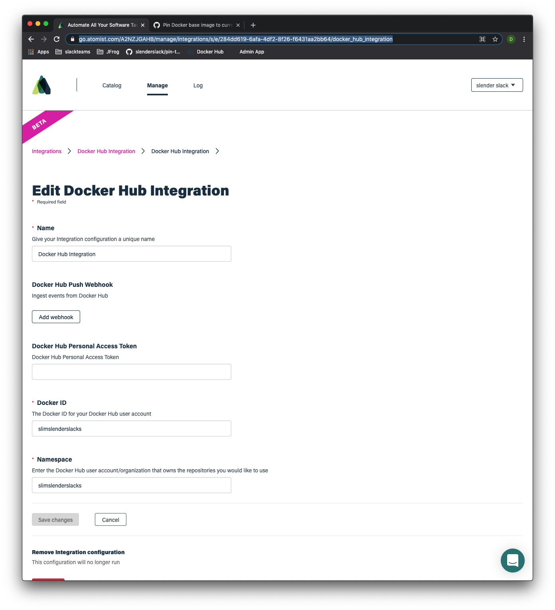
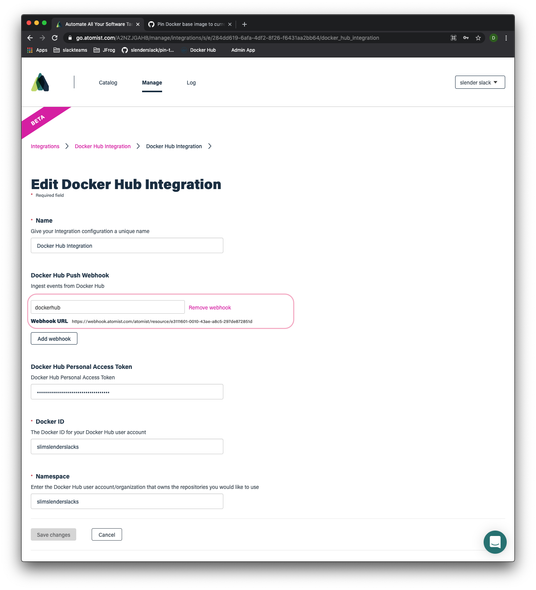
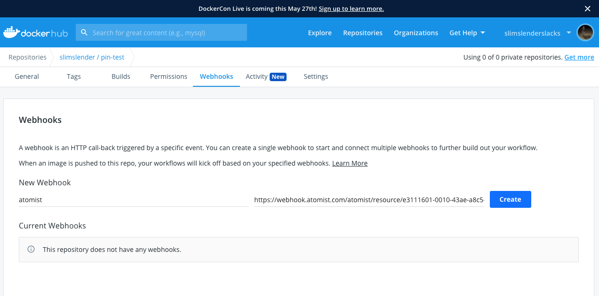

# Docker Hub

[Docker Hub](https://hub.docker.com/) supports webhook notifications for repositories in privately owned namespaces.
Atomist can ingest these notifications to drive policies like [Docker Base Image
Policy](https://go.atomist.com/catalog/skills/atomist/docker-base-image-policy).

### Creating Webhook

Navigate to the [Integrations tab](https://go.atomist.com/r/auth/manage/integrations) and select the Docker Hub
Integration (GCR and ECR integrations are available as well).

In configuration screen, you'll be able to add details about your private Docker Hub namespace.

Validate that the `Namespace` for your private repositories is correct, and then enter the `Docker ID` and a `Docker Hub
Personal Access Token` so that Atomist can query the repository when new Images and security scans are detected.
Finally, click the "Add webhook" button and "Save changes".

At present, you have to go back to the Integration Config screen a second time to retrieve the webhook url.

There will now be a Webhook URL in the config screen (see screenshot above).

### Setting Webhook on Docker Hub repository

Navigate to the Webhooks tab for one of your repos and copy the webhook into "Webhook URL" field.  The name of the
Webhook can be anything.

After clicking "Create", you'll see the Webhook listed under "Current Webhooks".

Atomist will now track updates to this repository.
